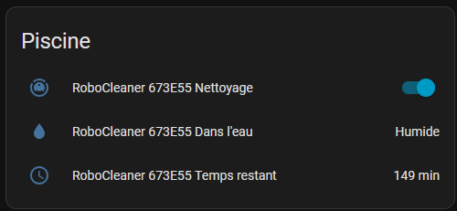

# BWT Cosmy - Home Assistant
BWT Cosmy robot cleaner integration for Home Assistant through Bluetooth.

## Features
- Control your BWT Cosmy robot via Bluetooth
- On/Off switch entity
- Status reporting (On/Off, cleaning time remaining)
- UI-based setup (no YAML required)
- Multi-language config flow (English, French)

## Requirements
- Home Assistant 2023.6 or newer recommended
- Bluetooth adapter or proxy supported by your system

## Installation
1. Install [HACS](https://www.hacs.xyz/docs/use/download/download/) (if not already installed).
2. Add `https://github.com/Hyrla/integration_bwt_cosmy_ha` as a custom repository on HACS and search for "BWT Cosmy" integration to install it.
3. Go to **Settings > Devices & Services > Add Integration** and search for "BWT Cosmy".
4. Enter your Cosmy BLE address (e.g. `AA:BB:CC:DD:EE:FF`)
5. The Cosmy entity will appear in Home Assistant.

## Usage
- Use the switch entity to turn the robot ON or OFF.
- The entity will show the remaining cleaning time.

## Troubleshooting
- Make sure your Bluetooth adapter is working and accessible to Home Assistant.
- The robot's station must be powered and in range. **The Cosmy Bluetooth antenna is really really weak**.
- If you have issues, check the Home Assistant logs for errors from `bwt_cosmy`. (``cat home-assistant.log | grep bwt_cosmy``)

## Links
- [GitHub](https://github.com/Hyrla/integration_bwt_cosmy_ha)
- [Issue Tracker](https://github.com/Hyrla/integration_bwt_cosmy_ha/issues)

## Supported Robot Models
- BWT Cosmy 100
- Other (if you have a different model, please report it)

## AI usage disclaimer
This integration was developed with the help of AI tools.

*Edit: it was 100% vibe coded*